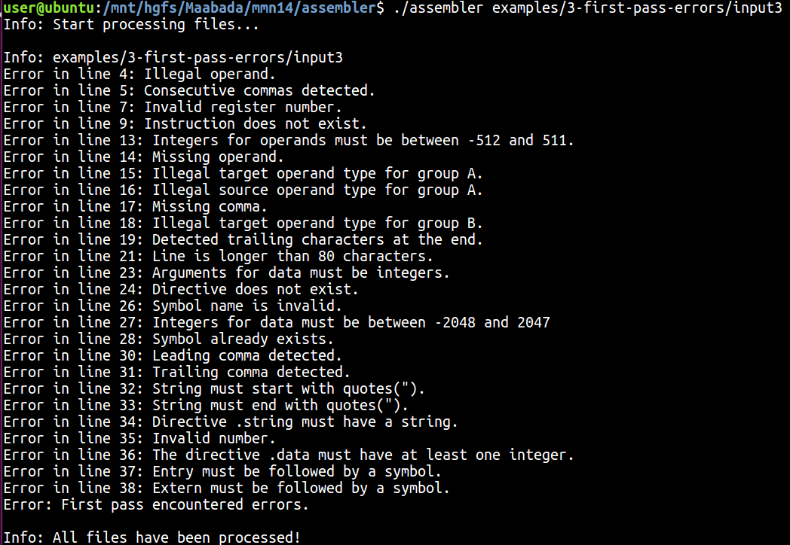

[# Maabada-Assembler-Project

## Project Description:

This project is a C programming assignment aimed at developing an assembler for a custom 12-bit assembly language. 
The project was developed by @MaayanKaidar and @TessaGoldchmit.

## Project Modules:

`assembler`: Contains the core logic of the assembler, handling the main processing function.
`ast`: The ast (Abstract Syntax Tree) module defines the data structure and functions related to the ast.
`data_structures`: Implements the data structures: code_image and data_image.
`first_pass`: Handles the processing of code lines during the first pass of the assembler.
`globals`: Defines types and constants used throughout the project.
`logs`: Contains log messages (infos and errors) and macros definitions related to them.
`output`: Provides methods for generating the output files: *.ob (object), *.ext (external), and *.ent (entry) files.
`pre_assembler`: Responsible for performing initial file preprocessing tasks, including spreading macros and removing empty lines & comments.
`second_pass`: Handles the processing of code lines during the second pass of the assembler.
`symbols`: Implements the symbols table and the extern symbols table.
`utils`: Contains general-purpose functions that are utilized across the project.

## How to use
In order to run the program on a file `prog.as`, run the following line:
```
./assembler prog
```

## Some examples

### Example 1 - A working example


### Example 2 - errors in preprocessing


### Example 3 - errors in first pass


### Example 4 - errors in second pass

